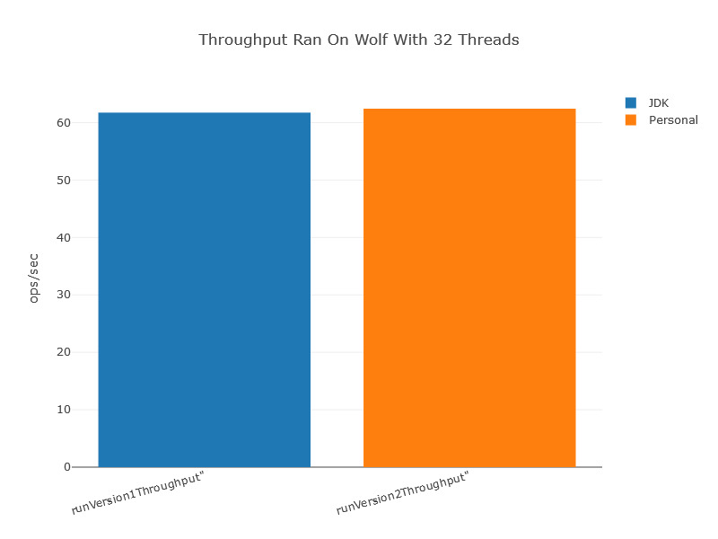
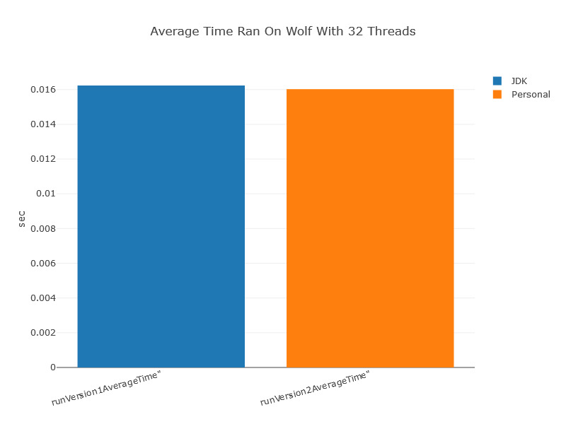
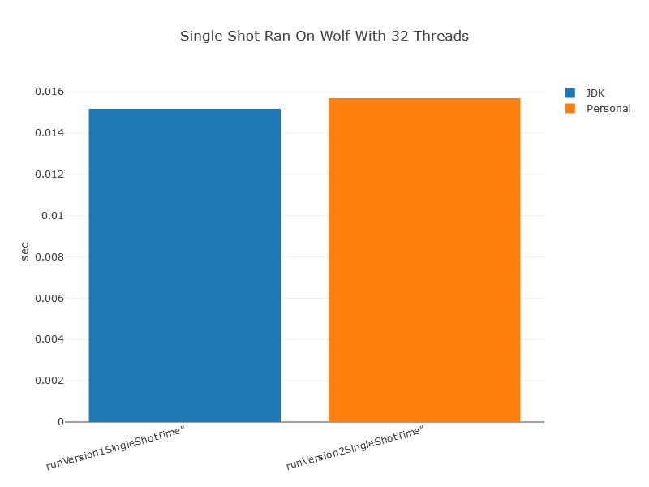
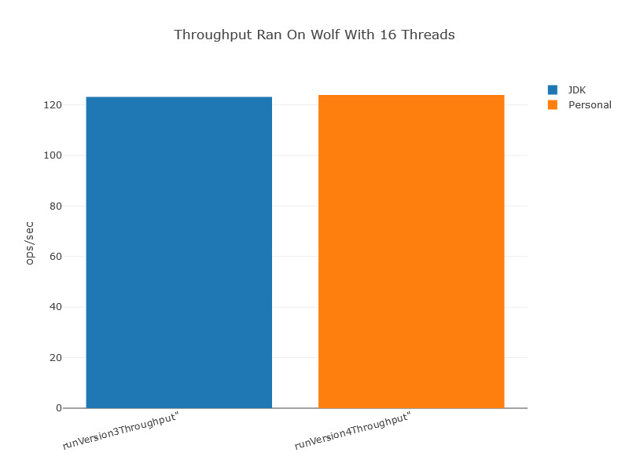
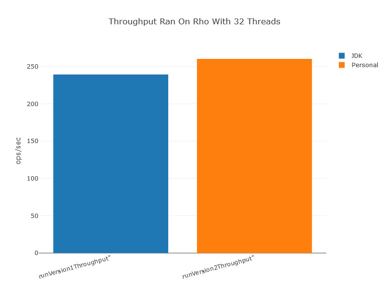
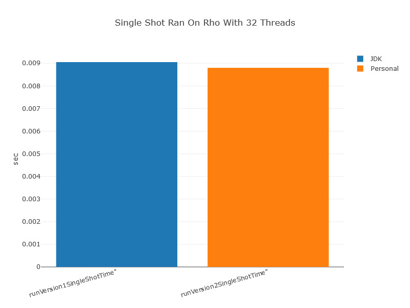

# Flight-Simulator
This project simulates a control tower trying to land planes in a real-time setting. Planes run in parallel and are admitted to the runway one at a time based on their priority (remaining gas &amp; total flight time).
Additionally this project utilizes JMH to run benchmarking on the flight simulator's use of the JDK's copyonwritearraylist, and again for the flight simulator's use of the thread-safe concurrent arraylist that I made.

##Samples From Project

###Benchmark Run On The Server Wolf Using 32 Threads

####Throughput

####Average Time

####Single Shot

###Benchmark Run On The Server Wolf Using 16 Threads

####Throughput

####Average Time

####Single Shot

###Benchmark Run On The Server Rho Using 32 Threads

####Throughput

####Average Time

####Single Shot

###Benchmark Run On The Server Rho Using 16 Threads

####Throughput

####Average Time

####Single Shot

## My Website
[My Website]
(http://cs.oswego.edu/~kzeller)